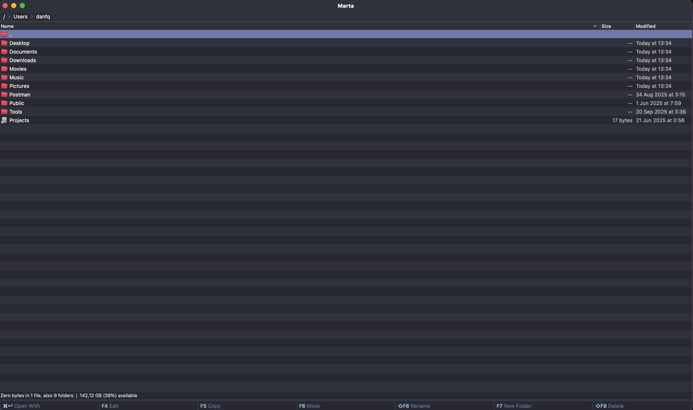

# Dracula for [Marta](https://marta.sh)

> A dark theme for [Marta](https://marta.sh).

## Install

All instructions can be found at [draculatheme.com/marta](https://draculatheme.com/marta).

## Team

This theme is maintained by:

|  |
| --------------------------------------------------------------------------- |
| [DanFQ](https://github.com/danfq)                                           |

## Community

- [Twitter](https://twitter.com/draculatheme) - Best for getting updates about themes and new stuff.
- [GitHub](https://github.com/dracula/dracula-theme/discussions) - Best for asking questions and discussing issues.
- [Discord](https://draculatheme.com/discord-invite) - Best for hanging out with the community.

## Dracula PRO

## License

[MIT License](./LICENSE)
